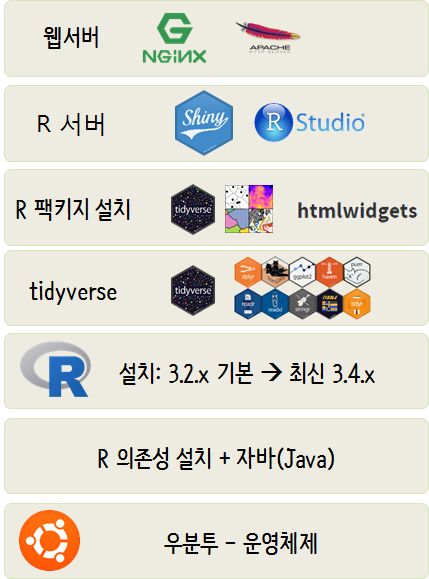
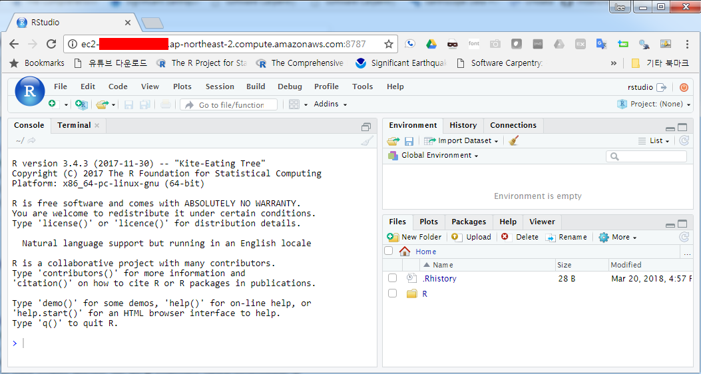

 
``` {r, include=FALSE}
source("tools/chunk-options.R")
knitr::opts_chunk$set(echo = TRUE, warning=FALSE, message=FALSE)

```


# 1. AWS EC2 인스턴스 인증된 웹앱 배포 [^ubuntu-with-r] {#ubuntu}

[^ubuntu-with-r]: [How to install R 3.4.0 and R Studio on a Ubuntu 16.04 installation.](http://jtremblay.github.io/software_installation/2017/06/21/Install-R-3.4.0-and-RStudio-on-Ubuntu-16.04)

R 설치 이전 우분투 위에 사전 정지작업이 필요하다. 운영체제를 설치한 후에 R을 설치하려면 R 및 R 팩키지가 의존하는 기반 소프트웨어를 다수 설치하여야 한다.
R을 올리기 전에 자바를 비롯한 R 코어 및 핵심 팩키지들이 필요로 하는 다수 소프트웨어를 사전에 설치한다.
R 설치 이전 의존성 갖는 대표적인 소프트웨어 설치의 사례는 다음과 같다.



## 1.1. R 의존성 설치 {#ubuntu-r}

`libcurl4-openssl-dev` 등 R 기능, 성능과 관련된 다수 소프트웨어를 설치한다.

``` {r r-dependency, eval = FALSE}
$ sudo apt-get update 
$ sudo apt-get install -y build-essential \
   fort77 \
   xorg-dev \
   liblzma-dev \
   libblas-dev \
   gfortran \
   gcc-multilib \
   gobjc++ \
   libreadline-dev \
   libcurl4-openssl-dev \
   libcurl4-gnutls-dev \
   default-jdk \
   texlive-latex-base \
   libcairo2-dev 
```

## 1.2. R 자바 설치 [^install-java-on-ubuntu] {#ubuntu-r-java}

[^install-java-on-ubuntu]: [How to install OpenJDK 8 on 14.04 LTS?](https://askubuntu.com/questions/464755/how-to-install-openjdk-8-on-14-04-lts)

최근에는 자바와 관계가 없이 동작하는 소프트웨어가 많이 개발되고 있지만, 여전히 기존에 개발된 자바의 기능을 
활용하는 R 및 R 팩키지가 많아서 자바 의존성과 관련하여 설치 및 환경도 정비한다.


``` {r r-dependency-java, eval = FALSE}
## 1.2. 자바 설치
sudo add-apt-repository -y ppa:webupd8team/java
sudo apt-get update

sudo apt-get -y install oracle-java8-installer
sudo apt-get -y install oracle-java8-set-default
java -version
```

# 2. 우분투 위에 최신 R 설치 {#lastest-R}

최신 R 버전을 설치하기 전에 먼저 우분투에서 관리하는 기본 R 버젼을 설치한다.
기본 R 버전은 3.2.x 버젼으로 최신 R 버전과 차이가 크기 때문에 이를 기반으로 작업하게 되면 
최신 팩키지의 신기능을 사용할 때 지원이 되지 않는 경우가 많기 때문에 가능하면 최신 버전 R을 설치한다.

크게 방향성이 두가지가 있는데, 기존 R을 그대로 두고 그 위에 신규 R 버젼을 설치하는 방식이 있고, 
다른 한 방식은 기존 R을 삭제하고 최신 R 버전을 설치하는 방법이다.

## 2.1. 기존 R 유지 후 신규 R 버전 설치 {#lastest-R-base-old}

`r-base`를 설치하면 우분투에서 관리하는 기본 R 버젼이 설치된다.

``` {r base-r-install, eval = FALSE}
## 1.2.  우분투 위에 R 설치
sudo apt-get install -y r-base
```

## 2.1.1. 최신 버전 R 설치 {#lastest-R-install}

[R 최신버젼 - 소스코드](https://cran.r-project.org/src/base/R-3/)을 담아놓은 웹사이트에서 
가장 최신 버전 R을 `wget` 명령어로 다운로드 받아 압축을 풀고 설치를 한다.
기계적인 과정이라 다음 코드를 쉘에서 실행하면 된다.


``` {r latest-r-install, eval = FALSE}
## 1.3. 최신 버젼 R 설치 
wget https://cran.r-project.org/src/base/R-3/R-3.4.3.tar.gz
tar -xvf R-3.4.3.tar.gz
./configure --prefix=/home/ubuntu/R-3.4.3 --with-readline=no --with-x=no --enable-R-shlib=yes --with-cairo=yes
make
```

경로명 추가 `nano ~/.bashrc` 명령얼르 실행하여 하단에 다음 환경설정된 경로를 지정하여 등록하면 로그인시 자동 적용되게 된다.

``` {r latest-r-install-env, eval = FALSE}
## 1.4. 최신 버젼 R 설치 
export PATH=~/R-3.4.3/bin:$PATH
export RSTUDIO_WHICH_R=~/R-3.4.3/bin/R
```

가장 최신 R 버젼이 설치된 모습은 다음과 같다.


```{r latest-R-install, eval=FALSE, hide = FALSE}
ubuntu@ip-xxx-xx-xx-xx:~$ R

R version 3.4.3 (2017-11-30) -- "Kite-Eating Tree"
Copyright (C) 2017 The R Foundation for Statistical Computing
Platform: x86_64-pc-linux-gnu (64-bit)

R is free software and comes with ABSOLUTELY NO WARRANTY.
You are welcome to redistribute it under certain conditions.
Type 'license()' or 'licence()' for distribution details.

  Natural language support but running in an English locale

R is a collaborative project with many contributors.
Type 'contributors()' for more information and
'citation()' on how to cite R or R packages in publications.

Type 'demo()' for some demos, 'help()' for on-line help, or
'help.start()' for an HTML browser interface to help.
Type 'q()' to quit R.
```

## 2.2. 기존 R 삭제 후 신규 R 버전 설치 [^install-latest-r-on-ubuntu] {#lastest-R-base-new}

[^install-latest-r-on-ubuntu]: [Installing latest version of R-base](https://askubuntu.com/questions/218708/installing-latest-version-of-r-base/436491#436491?newreg=7fa719b24b6d4fe3a5a7d9fb7657659b)

기존 R 버전을 제거하고 나서 신규 R 버전을 설치하는 과정을 거치게 되면 먼저 기존에 설치된 R 버전을 제거하거나
어떤 R도 설치되지 않은 상태에서 신규 버전을 설치하면 된다.

만약 이전 버전 R이 설치된 경우 다음 명령어로 제거한다.

``` {r base-r-remove, eval = FALSE}
$ sudo apt-get remove r-base-core
```

rstudio 저장소에서 최신 R 버젼을 확인 한 후에 `sudo apt-get install r-base` 명령어를 실행하게 되면 최신 R 버전을 설치하게 된다.

``` {r install-latest-r-core, eval = FALSE}
sudo add-apt-repository "deb http://cran.rstudio.com/bin/linux/ubuntu $(lsb_release -sc)/"

sudo apt-key adv --keyserver keyserver.ubuntu.com --recv-keys E084DAB9
sudo add-apt-repository ppa:marutter/rdev
sudo apt-get update
sudo apt-get upgrade
sudo apt-get install r-base
```

# 2. R 팩키지 설치 {#install-r-packages}

R Shiny 서버를 설치하기에 앞서 `shiny`도 R 팩키지의 일종이라 먼저 R 관련 팩키지를 설치한다.
개별적으로 팩키지를 설치하기 보다 많이 사용될 분야에 조합을 이루는 팩키지를 묶어 한번에 설치한다.

- shiny 서버 관련: 'shiny', 'rmarkdown', 'shinydashboard', 'shinyjs'
- 공간정보(`geospatial`) 관련: 'sp', 'rgdal', 'rgeos', 'adehabitatHR', 'geojsonio', 'maptools'
- `htmlwidget` 관련: 'leaflet', 'highcharter', 'DT'


``` {r install-r-packages-category, eval=FALSE}
## 2.1. shiny 팩키지 사전 설치  -----
sudo su - -c "R -e \"install.packages(c('shiny', 'rmarkdown', 'shinydashboard', 'shinyjs'), repos='https://cran.rstudio.com/')\""

## 2.2. geospatial 팩키지 설치  -----
sudo su - -c "R -e \"install.packages(c('sp', 'rgdal', 'rgeos', 'adehabitatHR', 'geojsonio', 'maptools'), repos='http://cran.rstudio.com/')\""

## 2.3. htmlwidget 팩키지 설치  -----
sudo su - -c "R -e \"install.packages(c('leaflet', 'highcharter', 'DT'), repos='http://cran.rstudio.com/')\""
```

# 3. Shiny 서버 설치  [^install-r-pkg] {#shiny-server}

[^install-r-pkg]: [Installing Shiny Server Open Source](https://www.rstudio.com/products/shiny/download-server/)

[RStudio](https://www.rstudio.com/)에서 **RStudio IDE**와 **Shiny**를 대표적인 제품으로 공급하고 있다.
물론 커뮤니티 무료버젼과 다양한 부가적인 기능이 포함되어 있는 상업용 버젼이 그것이다. 

[Installing Shiny Server Open Source](https://www.rstudio.com/products/shiny/download-server/)를 참조하여 Shiny 서버를 설치한다.

``` {r shiny-server-install, eval = FALSE}
## 2.2. shiny 서버 설치  -----
$ sudo apt-get install -y gdebi-core
$ wget https://download3.rstudio.org/ubuntu-12.04/x86_64/shiny-server-1.5.6.875-amd64.deb
$ sudo gdebi shiny-server-1.5.6.875-amd64.deb
```

정상적으로 Shiny 서버가 설치되었다면 다음과 같은 화면을 볼 수 있게 된다.


# 4. RStudio IDE 서버 설치 {#rstudio-server}

## 4.1. RStudio IDE 서버 설치 {#rstudio-server-install}

[RStudio Download RStudio Server](https://www.rstudio.com/products/rstudio/download-server/) 웹사이트를 참조해서 RStudio IDE 서버를 설치한다. 

``` {r shiny-rstudio-server-install-again, eval=FALSE}
## 2.3. RStudio 서버 설치  -----
$ wget https://download2.rstudio.org/rstudio-server-1.1.442-amd64.deb
$ sudo gdebi rstudio-server-1.1.442-amd64.deb
```

## 4.2. RStudio IDE 서버 환경설정 [^diff-r-version] {#rstudio-server-env-install}

[^diff-r-version]: [Using Different Versions of R](https://support.rstudio.com/hc/en-us/articles/200486138-Using-Different-Versions-of-R)

RStudio IDE 서버를 설치하게 되면 RStudio 서버에서 사용할 R 버젼을 기본 설치 장소를 `/usr/bin/R`와 같은 디렉토리를 검색하게 된다. 하지만, 최신 R을 설치하게 되면 설치 위치가 변경되기 때문에 이를 반영할 필요가 있다.

``` {r r-core-location, eval=FALSE}
/usr/bin/R
/usr/local/bin/R
```

우분투 로컬 컴퓨터에 설치해도 유사한 문제가 발생하기 때문에 이에 대해서 다음과 같이 설정을 반영한다.


다음 세가지 파일(`.bashrc`, `.profile`, `rserver.conf`) 모두 최신 R 버젼(R-3.4.3)을 설치한 위치가 `/home/ubuntu/R-3.4.3/bin/R`으로 가정한다.

- `~/.bashrc` 파일 환경추가 

``` {r bashrc-lastest-r, eval=FALSE}
export PATH=~/R-3.4.3/bin:$PATH
export RSTUDIO_WHICH_R=~/R-3.4.3/bin/R
```

- `~/.profile` 파일 환경추가 

``` {r profile-lastest-r, eval=FALSE}
export RSTUDIO_WHICH_R=/home/ubuntu/R-3.4.3/bin/R
```

- `/etc/rstudio/rserver.conf` 파일 환경추가 

``` {r rserver-lastest-r, eval=FALSE}
rsession-which-r=/home/ubuntu/R-3.4.3/bin/R
```

## 4.3. `rstudio` 사용자추가 {#rstudio-server-user}

`rstudio` 사용자를 추가해서 RStudio IDE 서버에 로그인 할 수 있다.
`sudo adduser rstudio` 명령어를 쉘에서 사용자를 추가할 수 있다.

> `$ sudo adduser rstudio`

AWS EC2에 설치된 RStudio IDE 서버 최신버전이 정상적으로 설치되었다면 다음과 같은 화면을 확인할 수 있다.




# 5. `tidyverse` 환경 설치  {#tidyverse-package}

Base R을 기반으로 작업을 하는 경우 `tidyverse` 환경설정이 필요는 없으니 생략해도 무관하다.
다만, `tidyverse` 기반 작업환경을 설치하는 경우 `tidyverse`가 의존하고 있는 기반 소프트웨어를 다음과 같이 사전에 설치한다.

- `libxml2-dev`
- `libcurl4-openssl-dev`
- `libssl-dev`

``` {r shiny-rstudio-tidyverse-dependency, eval=FALSE}
$ sudo apt-get -y install libxml2-dev libcurl4-openssl-dev libssl-dev
```

`tidyverse` 팩키지를 설치하는 방식은 쉘명령어로 설치하는 방식과 R을 실행시켜 `install.packages()` 명령어로 설치하는 방식 두가지가 있다.
`library(tidyverse)`가 동작되는 방식이 정답이다.


``` {r shiny-rstudio-shell-install, eval=FALSE}
$ sudo su - -c "R -e \"install.packages(c('tidyverse'), repos='https://cran.rstudio.com/')\""
```

``` {r shiny-rstudio-tidyverse-install, eval=FALSE}
> install.packages("tidyverse")
> library(tidyverse)
── Attaching packages ─────────────────────────────────────── tidyverse 1.2.1 ──
✔ ggplot2 2.2.1     ✔ purrr   0.2.4
✔ tibble  1.4.2     ✔ dplyr   0.7.4
✔ tidyr   0.8.0     ✔ stringr 1.3.0
✔ readr   1.1.1     ✔ forcats 0.3.0
── Conflicts ────────────────────────────────────────── tidyverse_conflicts() ──
✖ dplyr::filter() masks stats::filter()
✖ dplyr::lag()    masks stats::lag()
```


# 6. 웹서버 설치  [^install-rstudio-webserver] {#shiny-server-webserver}

[^install-rstudio-webserver]: [RStudio, Running Shiny Server with a Proxy]:(https://support.rstudio.com/hc/en-us/articles/213733868-Running-Shiny-Server-with-a-Proxy)

웹앱을 개발해서 배포할 경우 경우에 따라서는 특정인만 볼 수 있도록 안전장치를 강구하고자 할 때가 있을 것이다.
이런 경우 Shiny로 개발된 다양한 데이터과학, 인공지능 웹앱을 웹서버(`nginx`, 아파치 웹서버) 인증기능을 활용하는 것도 한 방법이다.


웹서버에서 계정과 비밀번호 인증된 사용자만 Shiny 웹앱에 접근할 수 있도록 해보자. [^data-science-riot-shiny] [^mgritts-shiny] [^Catherine-Ordun]

[^data-science-riot-shiny]: [Add Authentication to Shiny Server With Nginx, 2017-05-22](http://www.datascienceriot.com//r/shiny-nginx/)
[^mgritts-shiny]: [mgritts, Shiny Server on AWS, 2016-07-08](http://mgritts.github.io/2016/07/08/shiny-aws/)
[^Catherine-Ordun]: [Deploying an R Shiny App to AWS, 2017-12-31](http://tm3.ghost.io/2017/12/31/deploying-an-r-shiny-app-to-aws/)

## 6.1. `nginx` 웹서버 설치 {#shiny-nginx-server-webserver}

`nginx`를 설치하고 나서 방화벽 관련된 사항을 설치힌다. 그리고, 비밀번호 기반 인증을 위한 소프트웨어(`apache2-utils`)도 설치힌다.

``` {r install-webserver-nginx, eval = FALSE}
# nginx 웹서버 설치
$ sudo apt-get install -y nginx

# 방화벽 설정
$ sudo ufw enable
$ sudo ufw allow 'Nginx Full'

# 비밀번호 기반 인증을 위한 소프트웨어 설치
$ sudo apt-get install -y apache2-utils
```

> ### EC2 IP 주소 확인 
> 
> `curl checkip.amazonaws.com`


## 6.2. `nginx` 웹서버 및 `shiny` 서버 운영 {#shiny-nginx-server-webserver-operations}

비번을 넣어 인증관련 사항을 설정하려면 먼저 `nginx`, `shiny-server`를 정지시킨다.

``` {r install-webserver-nginx-operations, eval = FALSE}
$ sudo systemctl stop nginx
$ sudo systemctl stop shiny-server
```

### 6.2.1. `nginx` 환경설정  {#webserver-nginx}

`sudo nano /etc/nginx/sites-available/default` 명령어를 실행하고 다음 사항을 복사하여 붙여넣고 저장한다.

``` {r nginx-config, eval=FALSE}
server {
    listen 80;

    location / {
    proxy_pass http://12X.X.X.1:3838/;
    proxy_redirect http://12X.X.X.1:3838/ $scheme://$host/;
    proxy_http_version 1.1;
    proxy_set_header Upgrade $http_upgrade;
    proxy_set_header Connection "upgrade";
    auth_basic "Username and Password are required";
    auth_basic_user_file /etc/nginx/.htpasswd;
 }
}
```

### 6.2.2. `shiny` 환경설정  {#webserver-shiny}

`sudo nano /etc/shiny-server/shiny-server.conf` 명령어를 실행하고 다음 사항을 복사하여 붙여넣고 저장한다.

``` {r shiny-config, eval=FALSE}
server{
   listen 3838 12X.X.X.1;

   location / {
    site_dir /srv/shiny-server;
    log_dir /var/log/shiny-server;
    directory_index on;
  }
}
```

### 6.2.3. 사용자 등록 및 비번 설정 {#webserver-password}

비밀번호 기반 인증을 위한 소프트웨어 설치를 앞서 `sudo apt-get install -y apache2-utils` 수행했기 때문에
이를 활용하여 임의 사용자명(`victor`)을 등록하고 비번을 등록하면 된다. 다수 사용자를 추가해도 좋다.


```
$ cd /etc/nginx
$ sudo htpasswd -c /etc/nginx/.htpasswd victor
```

### 6.2.4. `nginx` 웹서버 및 `shiny` 서버 다시 시작 {#shiny-nginx-server-webserver-operations-restart}

사용자 및 비번 설정을 위해 정지시킨 `nginx` 웹서버 및 `shiny` 앱서버를 다시 재가동 시킨다.

``` {r install-webserver-nginx-operations-restart, eval = FALSE}
$ sudo systemctl start shiny-server
$ sudo service nginx start
```

# 7. 응용프로그램 설치 {#install-webapp}

RStudio IDE 서버 및 Shiny 서버가 설치되었다면 `shiny` 툴체인으로 개발한 웹앱을 서버에 배포한다.

`app.R` 혹은 `ui.R`, `server.R`로 개발된 shiny 웹앱을 `/srv/shiny-server/` 디렉토리 아래 신규 디렉토리를 만들어서 배포하면된다.

```{r shiny-webapp-directory, eval=FALSE}
/srv/shiny-server/
                 |
                 /victor
                 | server.R
                 | ui.R
```


## 7.1. 설치된 `shiny` 팩키지 환경연결 [^shiny-error] {#shiny-library-link} 

[^shiny-error]: [RStudio Shiny ERROR: there is no package called “shinydashboard”](https://stackoverflow.com/questions/28794261/rstudio-shiny-error-there-is-no-package-called-shinydashboard)

RStudio 서버와 Shiny 서버를 설치하고 나서 개발한 응용프로그램을 `/srv/shiny-server/` 디렉토리에 배포를 했으나 동작이 되지 않는 경우가 있다.
원인은 `shiny` 서버에서 해당 팩키지에 대한 접근이 보안등의 이유로 접근이 되지 않기 때문이다. 이에 대한 해결책 중 하나는 `shiny` 계정으로 관련 팩키지를 설치하는 것이다.

1. `sudo passwd shiny` 명령어로 `shiny` 계정 비밀번호를 설정한다.
1. `su - shiny` 명령어로 `shiny` 계정으로 바꿘서 시스템에 접근한다.
1. 쉘에서 `$ R` 명령어로 R을 실행시킨다. 다른 말로 `sudo R`로 R을 실행시키지 말자.
1. 그리고 나서 `> install.packages("shinydashboard")`와 같이 필요한 팩키지를 설치한다.

## 7.2. `shiny` 응용프로그램 오류 사항 확인 [^shiny-error-check] {#shiny-application-check-error} 

[^shiny-error-check]: [shiny-server, An error has occurred The application failed to start. The application exited during initialization.](https://github.com/rstudio/shiny-server/issues/153)

`shiny` 응용프로그램 오류 사항을 확인하는 방식 중 하나는 `/var/log/shiny-server/` 디렉토리에 쌓이는 로그를 살펴보는 것이다.

> `/var/log/shiny-server/*.log`
