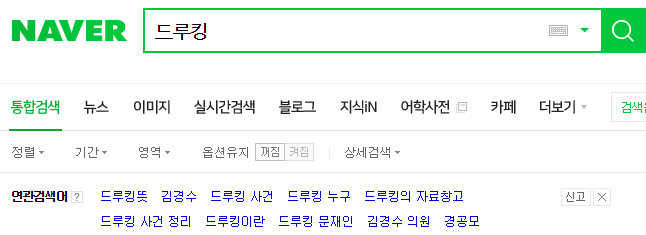
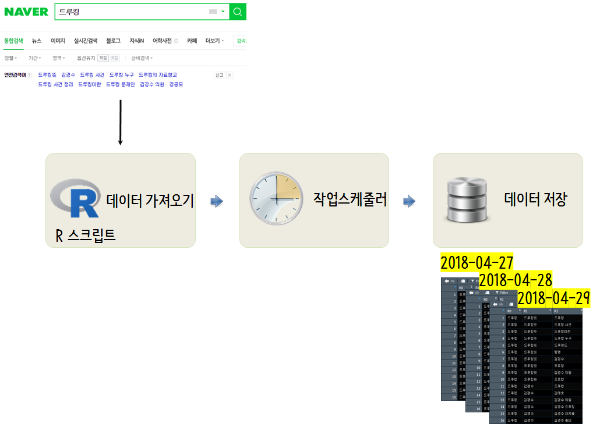
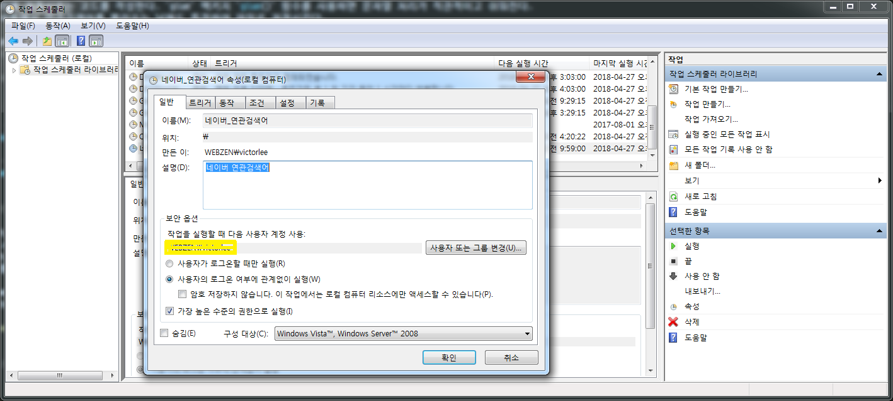

 
``` {r, include=FALSE}
source("tools/chunk-options.R")
knitr::opts_chunk$set(echo = TRUE, warning=FALSE, message=FALSE)

```

# 윈도 작업 스케쥴러 문제 {#cron-problem}

R 기반 작업 스케줄러를 사용할 때 인코딩 관련된 사항이 항상 문제가 된다. 
RStudio IDE 환경에서 작업할 때는 잘되던 것이 `R CMD BATCH`, `Rscript.exe` 윈도우 쉘환경에서 실행되면 문제가 생기는 경우가 다반사다.

이를 피해나가면서 자동으로 개발된 R 스크립트를 작업하는 방식을 살펴보자.

# 네이버 연관검색어 {#naver-related-search}

네이버에서 검색어를 입력하게 되면 연관검색어가 떠서 경우에 따라서는 미처 생각하지 못한 연상작용으로 검색품질을 높일 수도 있는 반면에
부정적인 연관검색어가 꼬리를 물고 붙어다니게 되어 불편한 경우도 있다. 



## 드루킹 연관검색어 {#druking-related-search}

[드루킹](https://namu.wiki/w/%EB%93%9C%EB%A3%A8%ED%82%B9)이 지방선거와 맞물려 2018년 역사적인 남북정상회담을 덮을 정도로 많은 영향력을 발휘하고 있다.
`r Sys.Date()` 시점기준 드루킹 연관검색어를 넣게 되면 다음과 같이 분석된다.
`rdevteam` 팩키지를 설치하고 나서 데이터를 `naverRelation()` 함수를 통해 불러온다. 
이를 리스트 자료형으로 데이터프레임과 networkD3 객체를 저장한다.

``` {r druking-related-search}
# 0. 환경설정 
library(rdevteam) # devtools::install_github("lovetoken/rdevteam")
library(tidyverse)
library(networkD3)
library(extrafont)
library(igraph)
loadfonts()

draw_naver_graph <- function(keyword) {

  dat <- naverRelation(keyword, depth = 2)
  
  x1 <- dat[,1:2]; colnames(x1) <- c("R1", "R2")
  x2 <- dat[,2:3]; colnames(x2) <- c("R1", "R2")
  
  new_x <- rbind(x1, x2)
  
  pre <- new_x %>%
    count(R2, R1) %>%
    graph_from_data_frame %>%
    igraph_to_networkD3
  
  pre$nodes$group <- ifelse(pre$nodes$name %in% dat$R0, "검색어",
                            ifelse(pre$nodes$name %in% dat$R1, "1차 연관어", "2차 연관어"))
  
  network_g <- networkD3::forceNetwork(Links = pre$links, Nodes = pre$nodes,
                          colourScale = JS("d3.scaleOrdinal(d3.schemeCategory10);"),
                          Source = "source", Target = "target",
                          Value = "value", NodeID = "name",
                          Group = "group", opacity = 0.7, zoom = T,
                          fontSize = 13, fontFamily = "NanumGothic", legend = T,
                          opacityNoHover = 0.9)
  res_list <- list(data=new_x, network=network_g)
  
}
```

## 드루킹 연관검색 {#druking-related-search-table}

앞서 저장한 객체를 꺼내 표와 네트워크 그래프로 시각화한다.

<div class = "row">
  <div class = "col-md-6">
**연관검색어 그래프**

```{r druking-network}
druking <- draw_naver_graph("드루킹")
druking$network
```

  </div>
  <div class = "col-md-6">
**연관검색어 데이터**

```{r druking-dataframe}
DT::datatable(druking$data)
```

  </div>
</div>

# 연관검색어 데이터 매일 저장 {#save-related-search-everyday}

상기 작업흐름의 문제점은 매일 "드루킹" 관련 연관검색어를 R에서 넣어 R 코드를 실행시켜야 된다는 점이다.
사람이 중간에 개입하게 되고, 따라서 연과검색어를 넣은 시점이 불규칙하다는 문제점도 함께 나올 수 있다.
이를 방지하는 목적과 함께 일관된 데이터를 축적하는 것도 매우 중요하다. 

이를 위해서 다음과 같은 작업흐름을 염두에 두고 윈도우 기반으로 일별 "드루킹" 관련 연관검색어를 파일에 저장시켜보자.
이와 같이 매일 특정 시간 작업을 컴퓨터에 시키게 되면 "드루킹" 관련 연관검색어 추이도 볼 수 있는 장점이 있다.



## 한글 유니코드 변환 {#convert-unicode}

한글을 R스크립트로 실행시키게 되면 윈도우 인코딩(CP949), RStudio(UTF-8)과 맞지 않아 상당한 고통을 겪게 된다.
이를 피해가는 방식으로 [Unicode Converter - Decimal, text, URL, and unicode converter](https://www.branah.com/unicode-converter)를 
사용해서 네이버 검색창에 사용할 검색어를 미리 유니코드로 변환시킨다.

- 드루킹 &rArr; `\ub4dc\ub8e8\ud0b9`
- 안철수 &rArr; `\uc548\ucca0\uc218`
- 이재명 &rArr; `\uc774\uc7ac\uba85`
- 박원순 &rArr; `\ubc15\uc6d0\uc21c`
- 김문수 &rArr; `\uae40\ubb38\uc218`
- 남경필 &rArr; `\ub0a8\uacbd\ud544`

## R 스크립트 작성 {#r-script-writing}

드루킹 &rArr; `\ub4dc\ub8e8\ud0b9` 관계를 확인했기 때문에 `naverRelation()` 함수에 넣어 검색결과를 
불러와서 특정 디렉토리에 저장시키는 코드를 작성한다. `glue` 팩키지 `glue()` 함수를 사용하면 문자열 처리가 직관적이고 쉬워진다.
`Sys.Date()` 함수를 사용해서 연관검색어를 불러오는 날짜도 특정하여 파일로 저장시킨다.

``` {r writing-rscript-druking, eval=FALSE}
# 파일명: naver_related_search_keyword.R
# 0. 환경설정 ------ 
library(rdevteam) # devtools::install_github("lovetoken/rdevteam")
library(tidyverse)
library(glue)

# 1. 데이터 가져오기 ------
druking_utf8_df <- naverRelation("\ub4dc\ub8e8\ud0b9", depth = 2)

# 2. 데이터 저장 ------
druking_utf8_df %>% write_csv(glue("c:/Users/webzen_\uc6f9\uc820_{Sys.Date()}.csv"))
```

## 윈도우 배치파일 작성 {#r-script-to-batch}

`naver_related_search_keyword.R`로 명명된 R스크립트를 윈도우 쉘에서 실행시키려면 몇가지 방식이 있는데 
그중 하나가 `Rscript.exe`를 실행시키는 것이다. 
`naver_related_search_keyword.bat` 파일로 저장시킨다. 
이유는 `.bat` 확장자를 갖는 파일은 윈도우 쉘에서 즉시 실행파일로 실행이 가능하기 때문이다. 

``` {r writing-widnows-batch, eval=FALSE}
- 파일명: naver_related_search_keyword.bat
@echo on
Rscript "C:\Users\naver_related_search_keyword.R"
```

## 윈도우 작업 스케줄러 등록 {#r-script-to-batch-scheduler}

윈도우 작업 스케줄러에 매일 특정시간을 맞춰 놓으면 R스크립트를 돌려 해당 시간 연관검색어를 자동으로 저장시킨다.



