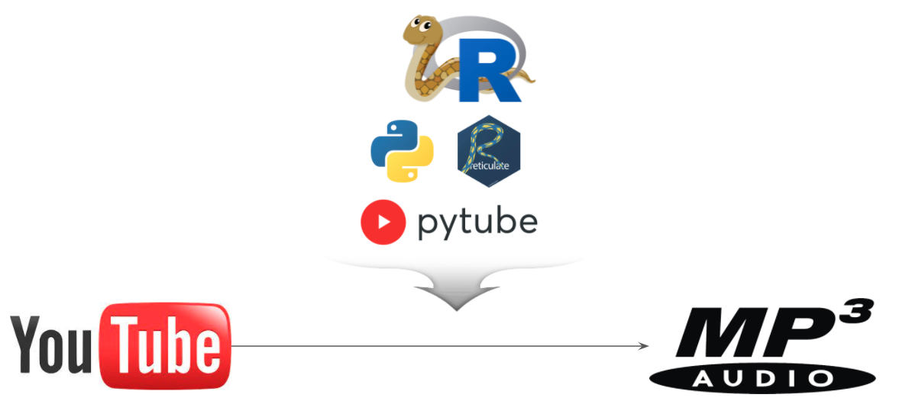

```{r setup, include=FALSE}
knitr::opts_chunk$set(echo = TRUE, message=FALSE, warning=FALSE,
                      comment="", digits = 3, tidy = FALSE, prompt = FALSE, fig.align = 'center')

knitr::opts_chunk$set(engine.path = list(
  bash = "C:\\WINDOWS\\SYSTEM32\\bash.exe"
))

```




# `pytube` {#pytube-mp3}

[`pytube`](https://github.com/pytube/pytube) 팩키지가 간단한 프로그래밍을 통해 유튜브에서 MP3파일을 변환/추출하여 통신비용 없이 MP3 파일로 음악을 즐길 수 있다.


```{r python-pytube, eval = FALSE}
python -m pip install pytube
```


```{bash reticulate-home, eval=FALSE, engine="sh"}
$ echo $RETICULATE_PYTHON
C:/Users/statkclee/anaconda3/python
```


```{r setup-python-mp3, eval = FALSE}
# Sys.setenv(RETICULATE_PYTHON="C:/Users/statkclee/anaconda3")
library(reticulate)

py_config()

```


```{python download-mp3, eval = FALSE}
from pytube import YouTube
import os

yt = YouTube("https://www.youtube.com/watch?v=h3sdYv3Ky40")

out_file = yt.streams.filter(only_audio=True).first().download()

# os.rename(out_file, "data/music/노라조-형.mp3")
os.rename(out_file, "data/music/웅산-인생.mp3")

```


```{r}
library(embedr)

embed_audio("data/music/웅산-인생.mp3",  attribute = c("controls", "loop"), placeholder = "웅산-인생")
```


